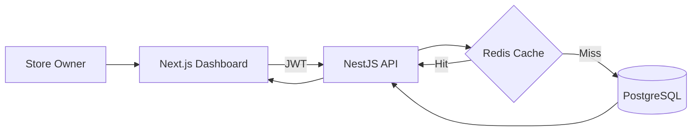
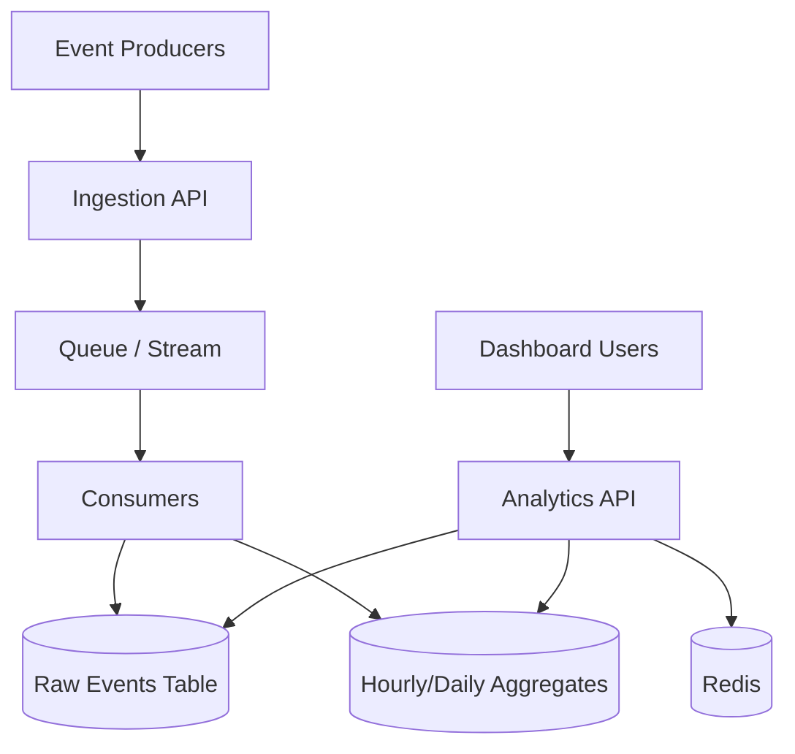

# Store Analytics Dashboard

A real-time analytics dashboard for eCommerce store owners built with NestJS + Next.js.


---

## Setup Instructions

### Prerequisites
- Node.js 20+
- pnpm (`npm install -g pnpm`)
- A Neon PostgreSQL database (or any PostgreSQL instance)

### 1. Clone & configure

```bash
git clone https://github.com/gamandeepsingh/Amboras
cd amboras
cp backend/.env.example backend/.env
# Fill in your DATABASE_URL, JWT_SECRET in backend/.env
cp frontend/.env.example frontend/.env.local
# Set NEXT_PUBLIC_API_URL=http://localhost:3001 in frontend/.env.local
```

### 2. Backend

```bash
cd backend
npm install
npx prisma db push          # create tables in your Neon DB
npm run seed                # seed 2 demo stores with 1200 events each
npm run start:dev           # starts on http://localhost:3001
```

### 3. Frontend

```bash
cd frontend
pnpm install
pnpm dev                    # starts on http://localhost:3000
```

### Demo accounts

| Store       | Email              | Password   |
|-------------|---------------------|------------|
| Acme Goods  | store1@demo.com    | demo1234   |
| Beta Shop   | store2@demo.com    | demo1234   |

---

## Architecture Overview



## Future Design


---

## Architecture Decisions

### Data Aggregation Strategy

**Decision:** On-demand SQL aggregation with TTL caching (Redis when `REDIS_URL` is configured, in-process fallback otherwise).

**Why:** A single CTE query handles all three revenue windows (today / week / month), the conversion rate, and event counts in one database round-trip. The composite index on `(store_id, timestamp DESC)` lets PostgreSQL perform an index range scan scoped to one store without a full table scan.

**Trade-offs:**
- ✅ Accurate data on every cache miss
- ✅ Redis cache allows horizontal scaling with shared cache state
- ✅ In-memory fallback keeps local development simple
- ❌ At 10M+ events/store, the CTE scan will degrade. The production fix is a `daily_aggregates` table (pre-aggregated by a DB trigger or `@nestjs/schedule` cron), reducing the aggregation query from O(events) to O(days)

### Real-time vs. Batch Processing

**Decision:** Short-TTL polling (8s for activity feed, 6s for live visitors) rather than WebSocket push.

**Why:** For a dashboard refreshing every few seconds, polling over HTTP/2 is simpler to deploy, cache-friendly, and easily scalable. True WebSocket push requires sticky sessions or a pub/sub broker (Redis, NATS) which adds infrastructure complexity disproportionate to the demo.

**Trade-offs:**
- ✅ No state to manage server-side per connection
- ✅ Works seamlessly through load balancers
- ❌ Each client generates a request every 8s. At 10,000 concurrent users that's ~1,250 RPS on the activity endpoint alone. Fix: WebSocket gateway with `@nestjs/websockets` + Redis pub/sub, or Server-Sent Events with `@nestjs/sse`

### Multi-Tenancy

Store isolation is enforced at the API layer: `storeId` is embedded in the JWT payload at login and read from `req.user.storeId` on every analytics endpoint. It is never accepted as a URL parameter or request body field. A compromised token only exposes that user's own store data.

### Performance Optimizations

| Technique | Impact |
|-----------|--------|
| Composite index `(store_id, timestamp DESC)` | Eliminates full table scans; all queries are scoped to one store + time window |
| Single CTE query for overview | 1 DB round-trip vs 3; saves ~2× network latency on each cache miss |
| Redis TTL cache (with in-memory fallback) | Shared cache across replicas; fast repeated reads |
| `store_id::text = $1` comparison | Works around Prisma v5's text-typed parameterized bindings on UUID columns |

### Frontend Data Fetching

**Decision:** TanStack Query v5 with per-component `useQuery` hooks, side effects via `useEffect` watching `query.data` (not deprecated `onSuccess` callback).

**Why:** Gives each panel independent loading/error states, automatic background refetch, and shared cache deduplication. The activity feed and live visitors use `refetchInterval` to simulate real-time updates without WebSockets.

---

## Known Limitations

1. **No event ingestion API** — seed data is static. A production system needs `POST /api/v1/events/ingest` with rate limiting, idempotency via `event_id`, and an async queue (BullMQ) to absorb bursts
2. **Redis is optional** — if `REDIS_URL` is not set, cache falls back to in-process memory
3. **Live visitors use event volume proxy** — currently counts events in last 5 minutes; production-grade active users should use explicit session tracking
4. **No refresh token** — JWT expires in 7 days with no rotation

---

## What I'd Improve With More Time

1. **Pre-aggregated daily_aggregates table** — cron job writes daily rollups, overview query reads ≤90 rows instead of millions
2. **WebSocket activity feed** — NestJS `@WebSocketGateway` + Redis pub/sub for true push
3. **Event ingestion endpoint** — `POST /events` with schema validation + BullMQ async processing
4. **Unit tests** — `AnalyticsService` with mocked `PrismaService`; auth guard tests
5. **Refresh tokens + httpOnly cookies** instead of localStorage JWT
6. **Materialized aggregates** — hourly/day-level rollups for much larger historical datasets

---

## Video Walkthrough

- Loom/YouTube link: `<add-your-video-link-here>`
- Demo: login, metrics, filters, responsiveness
- Code walkthrough: aggregation query + caching strategy
- Reflection: challenges, trade-offs, next improvements

---

## Submission Checklist

- [✔] Code runs locally
- [✔] README includes architecture decisions and trade-offs
- [✔] Video walkthrough recorded and linked
- [✔] Environment variable examples are included
- [✔] No secrets committed
- [✔] Public GitHub repo link added

---

## Time Spent

Approximately 3.5 hours.

- Backend (NestJS + Prisma + seed): ~1.5h
- Frontend (layout + components + animations): ~1.5h
- Deplyment: ~0.5h
